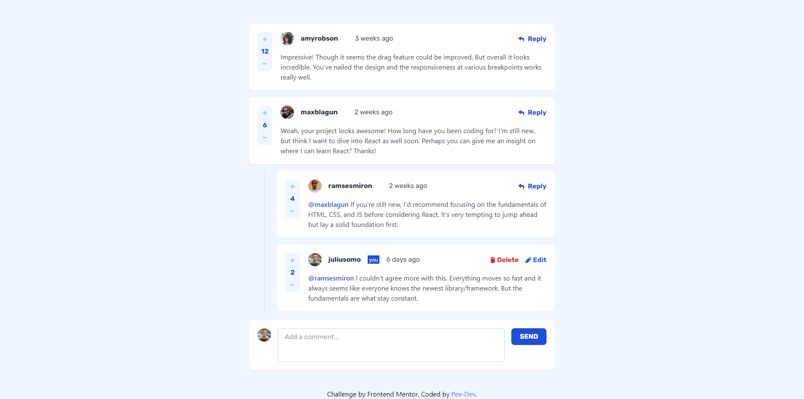
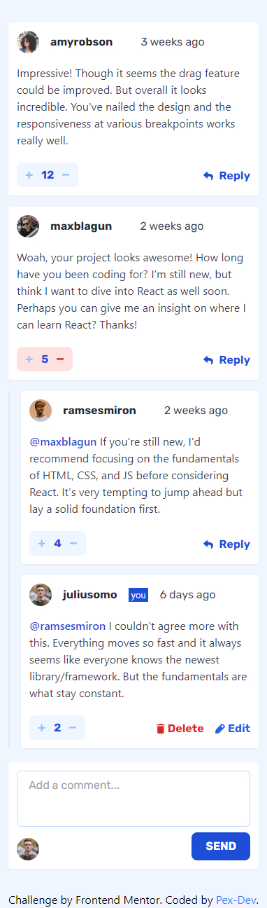

# Frontend Mentor - Interactive comments section solution

This is a solution to the [Interactive comments section challenge on Frontend Mentor](https://www.frontendmentor.io/challenges/interactive-comments-section-iG1RugEG9). 

## Table of contents

- [Overview](#overview)
  - [The challenge](#the-challenge)
  - [Screenshot](#screenshot)
- [My process](#my-process)
  - [Built with](#built-with)
  - [What I learned](#what-i-learned)
  - [Continued development](#continued-development)
- [Author](#author)

## Overview

### The challenge

Users should be able to:

- View the optimal layout for the app depending on their device's screen size
- See hover states for all interactive elements on the page
- Create, Read, Update, and Delete comments and replies
- Upvote and downvote comments
- **Bonus**: If you're building a purely front-end project, use `localStorage` to save the current state in the browser that persists when the browser is refreshed.
- **Bonus**: Instead of using the `createdAt` strings from the `data.json` file, try using timestamps and dynamically track the time since the comment or reply was posted.

### Screenshot

|  |  |
|:------------------------------:|:------------------------------:|
| screenshot of the site on a PC     | screenshot of the site on mobile devices     |

## My process

### Built with

- Semantic HTML5 markup
- Tailwind CSS classes
- JavaScript

### What I learned

I learned how to load json files using fetch and store information locally with localStorage.

### Continued development

I'm not really proud of the javascript code I created, but it's the only way I know how to generate html code, maybe later I'll learn some javascript framework.

## Author

- Frontend Mentor - [@Pex-Dev](https://www.frontendmentor.io/profile/Pex-Dev